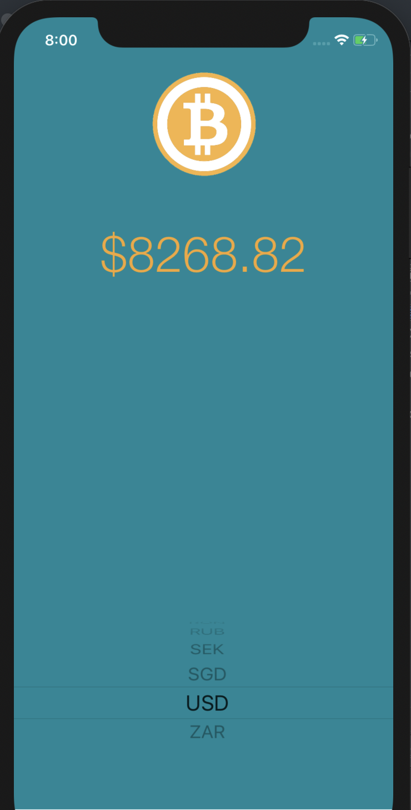

#  Bitcoin Ticker

This application is a Bitcoin price tracker. It gives users the latest Bitcoin prices in all traded currencies, so you can track how well your Bitcoin investments are doing. 



# Getting Started 
Note: All data is retrieved from bitcoinaverage.com 

Once the app is opened, users just have to change the type of currency they wish to see the price of bitcoin from a particular country. The signs will change based the currency selected. 

# Built With

- Swift
- Alamofire
- SwiftyJSON
- Storyboard (For Design)

# Code Snippets

```
func getBitcoinData(url: String) {  
    Alamofire.request(url, method: .get)
        .responseJSON { response in
            if response.result.isSuccess {

                print("Sucess! Got the bitcoin data")
                let bitcoinJSON : JSON = JSON(response.result.value!)

                self.updateBitcoinData(json: bitcoinJSON)

            } else {
                print("Error: \(String(describing: response.result.error))")
                self.bitcoinPriceLabel.text = "Connection Issues"
            }
        }
}

```

The code above is an example of using Alamofire to request data. In this case, the function takes in a string URL and sends a GET request to return a JSON data to use. The if statement is a error check to see if the data return is successful and if it is then we assign the data to a variable. 

# Author
* **Muhammad** - https://github.com/mawais54013